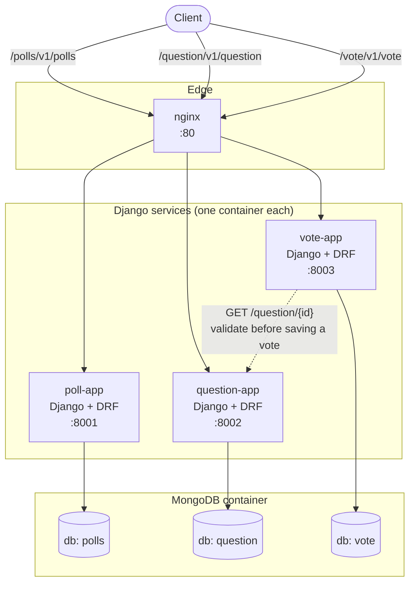

## Designing Microservices Architecture with Django Framework

> [!NOTE]
> This project has been unmaintained for about 6 years and has now been revived. It's been upgraded to Django 5.2 LTS, MongoDB 7, Python 3.12 and modern Docker Compose. Along with several fixes to the original code. See the [Tools](#tools) section below for the current stack.

### Architecture

Each service is its own Django project, container, and database. There is no shared ORM or shared models between them. `nginx` is the only entry point and reverse-proxies each path prefix to its service. The one cross-service link is from `vote` to `question`, done as a plain HTTP call rather than a database relation, since `vote` has no access to `question`'s database or models.

This is only an example of scaling Django features using a microservices pattern. Is Django with microservices a good idea? It **depends** on your perspective. Django can feel bloated, or even overkill, in a microservices setup, since it's a batteries-included framework. On the other hand, it can make sense if you have a good reason for it: large services that need to scale independently, or a database you're confident can't handle everything on its own.

The models are based on the Django polls tutorial from the Django documentation, but split here into three services: `Polls`, `Question` and `Vote`.

Another big difference is that microservices favor loose coupling, which runs against Django's naturally tightly coupled style.

### Trade-offs with Separated Databases within Containers

This depends on how much traffic you expect, how many services you want to scale, and your own requirements. There are pros and cons to this pattern. If reusability or customizability matters to you, it can be a good fit, since each service can integrate independently with any frontend framework or database, and containers start up in well under a second. If your data matters more than that flexibility, you might be better off with a different pattern, such as an isolated database without Docker, or a shared database.

### Tools

- Docker / Docker Compose v2
- nginx
- MongoDB 7, via [django-mongodb-backend](https://github.com/mongodb/django-mongodb-backend), MongoDB's official, maintained Django backend. This project used to run on `djongo`, which has been unmaintained for years and doesn't support current Django.
- Django 5.2 LTS + Django REST Framework

### Issues

The original issue here was fetching data across services: `vote` needs to know a `question` exists, but each service has its own database and codebase, so a Django `ForeignKey` between them was never actually possible. That's now resolved the way Tom Christie suggested back when this was first written: `vote` stores the question's id and validates it with a synchronous HTTP request to the question service instead of pretending it's a database relation.

### Are We Ready (Yet)?

Still no. This remains a demo and reference project, not a production template. If you build on it, you'll want at least: authentication, request timeouts and retries with circuit breaking around the inter-service HTTP calls, and a real secrets story instead of `SECRET_KEY` env vars with dev-only fallbacks.

### Getting Started

- Clone this repository
- Change directory to where `docker-compose.yaml` lives
- Build with `docker compose build` (or `make build`)
- Once the build completes, run `docker compose up -d` (or `make up`)
- Other commands include `make down` to stop the services, and `make logs` to tail the logs of all services
- Navigate to localhost, something like `0.0.0.0:8001` for the `Poll` API, and so on

### Testing

With the stack running, try to run `make test` which is, it will runs a small end-to-end check across all three services: create a question, vote on it and confirm it shows up when viewing polls. It also checks that voting on a question id that doesn't exist is rejected. All integration tests should pass without errors.
